# End-to-End Deep Learning Pipeline for Particle Detection on Microlens Arrays
Tony Pulzer · Senior Automation & Machine Vision Engineer · mail@t-pulzer.com

## Abstract

In the optical and photonics industry, reliable detection of small particles and defects is a critical aspect of quality control for a wide range of optical components.

Even minor contaminations can degrade optical performance and, in high-power laser applications, may contribute to laser-induced damage of optical components [1]. As a result, inspection during production and prior to deployment is essential.

While conventional image processing methods perform well on simple geometries such as flat surfaces or standard lenses, they often reach their limits when applied to complex, periodically structured surfaces. Microlens arrays (MLAs) are a representative example of such structures [2].

The objective of this project is to evaluate a machine learning–based approach to overcome these limitations. An end-to-end deep learning pipeline is designed, covering dataset generation, preprocessing, model training, evaluation, and inference within a reproducible Python-based framework. The system is optimized to minimize false negatives while maintaining robustness in visually complex scenarios.

**Keywords:** Python · Deep Learning · Supervised Learning · CNN · Particle Detection · CUDA · Docker · WSL


## Table of Contents
- [Problem Context](#problem-context)
- [Approach](#approach)
- [Training Data](#training-data)
- [Model Architecture (U-Net)](#model-architecture-u-net)
- [Training Pipeline](#training-pipeline)
- [Model Training](#model-training)
- [Experimental Setup](#experimental-setup)
- [Results](#results)
- [Alternative Approaches - Anomaly-Based Particle Detection](#alternative-approaches---anomaly-based-particle-detection)
- [References](#references)


## Problem Context

Detecting particles in complex structures is a challenging task.
<p>
    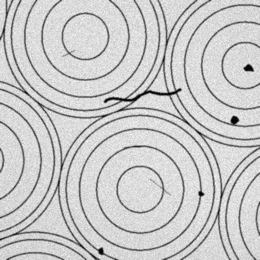
    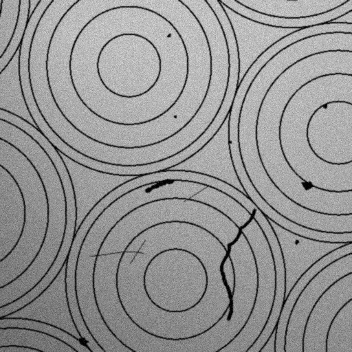
    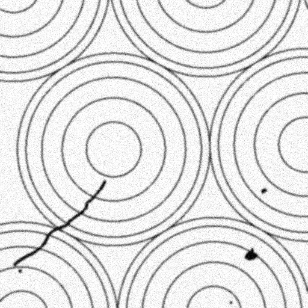
</p>

The images above illustrate representative examples from the synthetic dataset used in this project. They show a structured surface with concentric ring patterns, simulating Fresnel-like microlens array geometries, and highlight different types of particle contamination ranging from small, compact spots to elongated and irregular shapes. Such image data can typically be acquired using digital imaging systems with appropriate illumination for high-resolution inspection of optical surfaces.

Several factors make particle detection in such images particularly difficult:

- particles and underlying structures share similar intensity and contrast  
- particles are directly superimposed on structured backgrounds
- complex and noisy backgrounds
- wide variation in particle shape and size  
- variable brightness and intensity gradients across the image  

Traditional approaches based on sequential operations such as filtering, thresholding, and contour detection are effective under controlled conditions but often fail to generalize to complex and variable scenarios.

Recent work has shown that automated inspection of optical surfaces can be significantly improved using machine learning approaches. In particular, convolutional neural networks (CNNs) combined with semantic segmentation have demonstrated strong performance in detecting and classifying surface defects on optical components [3]. A data-driven approach is therefore adopted in which a neural network learns to distinguish particles from background structures based on spatial patterns, shape, and contextual information, enabling more robust and scalable analysis.

## Approach

A supervised learning pipeline was implemented to solve the particle detection task using convolutional neural networks.

The solution is built as a complete end-to-end workflow, covering data generation, model training, and inference. The focus is on creating a robust and reproducible system that can handle complex image structures and varying conditions.

The core components of the approach are:

- **Synthetic dataset generation and annotation**  
  A fully controlled dataset was generated, including corresponding segmentation masks for supervised training.

- **ML infrastructure setup**  
  A containerized GPU-accelerated training environment was established using WSL, Docker, and CUDA to ensure reproducibility and efficient experimentation.
    ```
    Windows Host (GPU + NVIDIA Driver)
    └── WSL (Linux)
        └── Docker
            └── CUDA-enabled container (CUDA runtime)
                └── PyTorch / Training Code
    ```

- **Model architecture selection**  
  For the segmentation task, a compact U-Net architecture was selected, following established work [4] in the field of image segmentation. U-Net has become a widely adopted standard for pixel-wise prediction tasks [5], particularly in scenarios involving limited training data, fine structures, and complex backgrounds.

  Its encoder–decoder structure [6] enables the extraction of hierarchical features while preserving spatial detail, making it well-suited for detecting small particles superimposed on structured patterns.

- **Model training**  
  The network was trained on the generated dataset to learn spatial and contextual features for particle detection.

- **Validation and inference**  
  Model performance was evaluated on previously unseen data to assess generalization beyond the training distribution.

The implementation is modular and designed for scalability, allowing the pipeline to be adapted to different datasets and extended with additional training or evaluation strategies.


## Training Data

The supervised learning setup uses paired data samples, where each input image is associated with a corresponding binary segmentation mask (ground truth).

<p>
  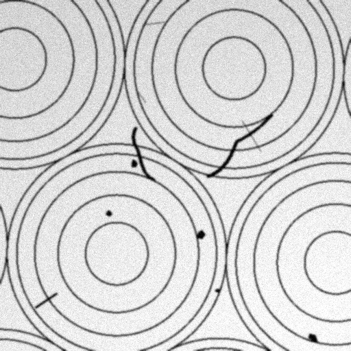
  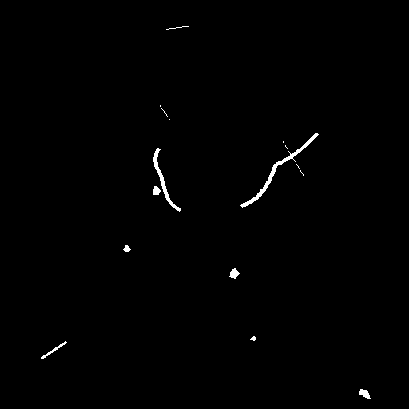
</p>

Each mask represents the annotated particle regions, where pixels belonging to particles are labeled as foreground(white) and all other pixels as background(black).

The dataset used in this project is synthetically generated, allowing full control over particle properties such as shape, size, and distribution, as well as the underlying structured background. Care was taken to prepare a diverse and extensive dataset to support robust model training.

Further, data diversity was increased through augmentation techniques such as Gaussian blur, additive noise, illumination gradients, gamma variations, and randomized intensity inhomogeneities.

> Note: The synthetic dataset used in this project serves as a proof of principle. In practical applications, training would preferably rely on real-world annotated data.


## Model Architecture (U-Net)

The diagram below illustrates the U-Net architecture used in this project. It consists of two encoder stages, a central bottleneck, and two decoder stages. The encoder (left side) progressively extracts features from the input image while reducing spatial resolution, whereas the decoder (right side) reconstructs the segmentation map at the original image size.

<p>
    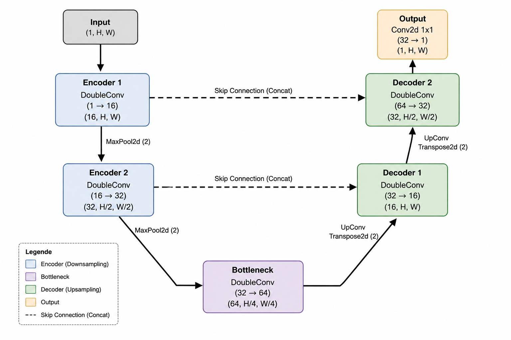
</p>

The skip connections shown between encoder and decoder stages transfer fine-grained spatial information, enabling accurate localization of small particles despite the intermediate downsampling. The bottleneck represents the most compressed feature representation, capturing the global context of the image.

Overall, this compact U-Net design provides an effective balance between computational efficiency and segmentation accuracy for structured backgrounds.


## Training Pipeline

The training pipeline is designed to efficiently process large datasets while maximizing GPU utilization.  
Special attention was given to avoiding I/O bottlenecks in order to maintain a continuous data stream to the GPU.

```txt
Disk (.npy / memmap)
    ↓
NumPy (on-demand access)
    ↓
Dataset (slice-based sampling)
    ↓
DataLoader (parallel loading + prefetching)
    ↓
Tensor (float32 → mixed precision)
    ↓
GPU (model training)
```

Data is accessed on demand using NumPy memmap, enabling scalable handling of large datasets without loading them entirely into memory. A custom dataset abstraction retrieves samples efficiently, while a parallelized DataLoader with prefetching ensures that data is continuously available during training.

Efficient training performance and optimization was achieved through the following measures:

- Zero-copy data access to minimize unnecessary memory duplication during tensor conversion
- Parallel data loading with multiple workers and prefetching to maintain a continuous data stream to the GPU
- Pinned memory to accelerate host-to-device data transfers
- Mixed precision training to reduce memory consumption and improve computational throughput
- Optimization of GPU memory (VRAM) utilization and batch size configuration for stable and efficient training
- Empirical tuning of training parameters such as learning rate, batch size, and number of workers
- Potential future extensions include gradient accumulation to support larger effective batch sizes under limited GPU memory constraints


## Model Training

During training, the input image is processed by the neural network in a forward pass to generate a predicted segmentation mask. The prediction is compared with the corresponding ground truth mask using a BCE-Dice loss function to compute the segmentation error. During the backward pass (backpropagation), gradients of the loss with respect to the model parameters are computed and propagated through the network. The model weights are then updated using the Adam optimizer to iteratively reduce the prediction error over successive training iterations.

<p>
    
</p>

For optimization, the Adam optimizer was used due to its robust convergence behavior and widespread use in deep learning–based image segmentation tasks [7].

For training a combined BCE-Dice loss function was used. Binary Cross-Entropy (BCE) loss evaluates pixel-wise classification accuracy, while Dice loss emphasizes overlap quality between predicted and ground truth regions. Compound loss functions combining cross-entropy–based and Dice-based terms are commonly used in semantic segmentation tasks, particularly in scenarios involving class imbalance and small target structures [8][9].


## Experimental Setup

<table>
<tr>
<td valign="top">

<b>Training</b><br>

Dataset Size: 5000 Samples<br>
Train / Validation: 4000 / 1000<br>
Optimizer: Adam<br>
Loss: BCE-Dice<br>
Learning Rate: 2e-4<br>
Batch Size: 32<br>
Precision: Mixed Precision<br>
Strategy: Early Stopping


<td valign="top">

<b>Model</b><br>

Architecture: U-Net<br>
Base Channels: 16<br>
Parameters: 117,393<br>
ONNX Model Size: 502 kB<br>
Input Size: 512 × 512<br>
Input Format: 8-bit Grayscale


<td valign="top">

<b>Hardware</b><br>

GPU: NVIDIA RTX PRO 2000<br>
VRAM: 8 GB<br>
CPU: Intel Core Ultra 7 265HX<br>
Memory: 32 GB DDR5<br>
Framework: PyTorch + CUDA

</td>
</tr>
</table>


## Results

The proposed U-Net architecture demonstrated stable convergence behavior throughout training and achieved strong segmentation performance on previously unseen validation data.

Training and validation loss decreased consistently over the course of training, while the validation Dice score converged at approximately 0.97, indicating a high spatial overlap between predicted and ground-truth particle masks [10].

### Training Metrics

<p>
    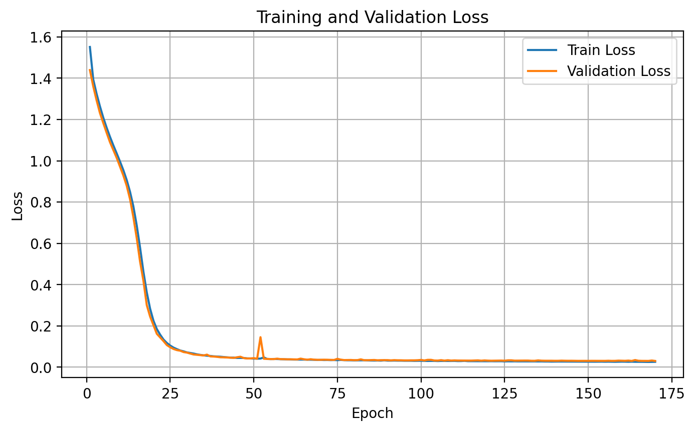
    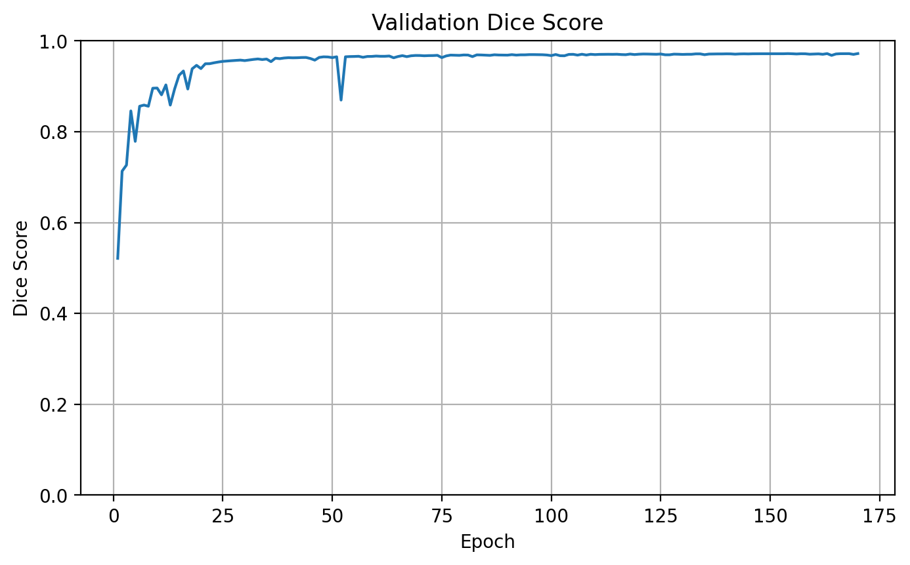
</p>

The training curves show stable optimization behavior without significant divergence between training and validation performance, indicating good generalization on the synthetic validation dataset.

While training continued until epoch 170 before early stopping was triggered, the validation metrics showed only minor improvements during later training stages. Earlier stopping criteria may therefore provide a more efficient trade-off between training time and segmentation performance.

### GPU Performance

<p>
    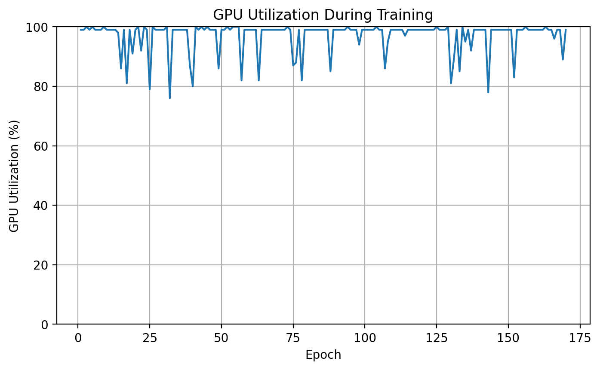
</p>

High GPU utilization was maintained throughout training, demonstrating efficient data loading and optimized pipeline throughput. VRAM utilization remained consistently close to 90% during training, indicating that the available hardware resources were utilized efficiently throughout the training process.

### Inference Examples

<table>
<tr>
<th>Input</th>
<th>Prediction</th>
<th>Overlay</th>
</tr>

<tr>
<td>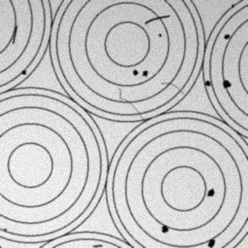</td>
<td>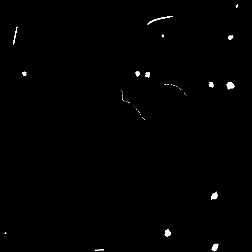</td>
<td>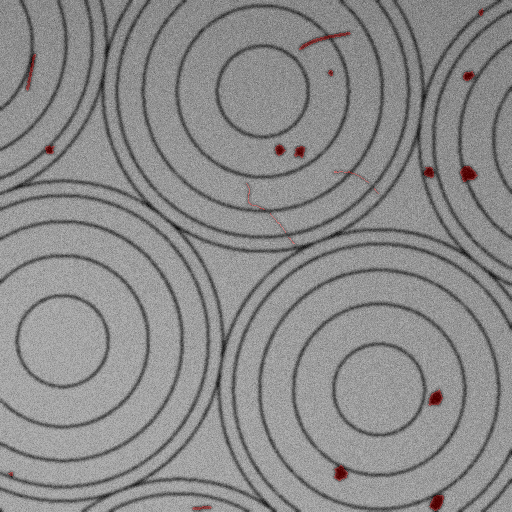</td>
</tr>

<tr>
<td>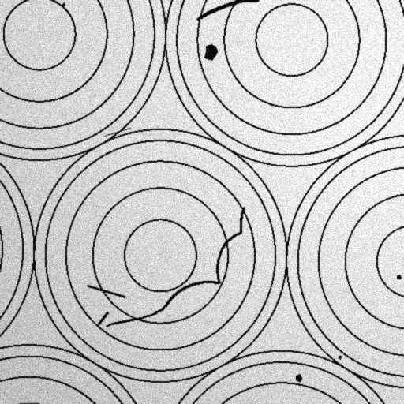</td>
<td>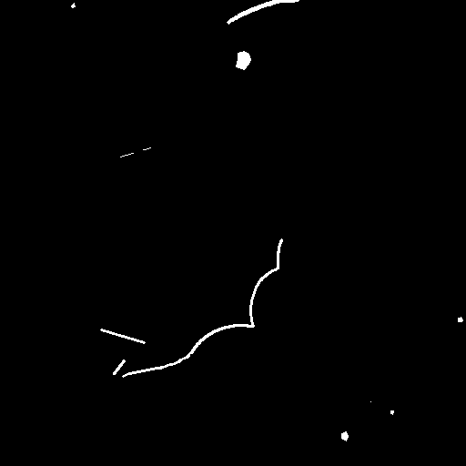</td>
<td>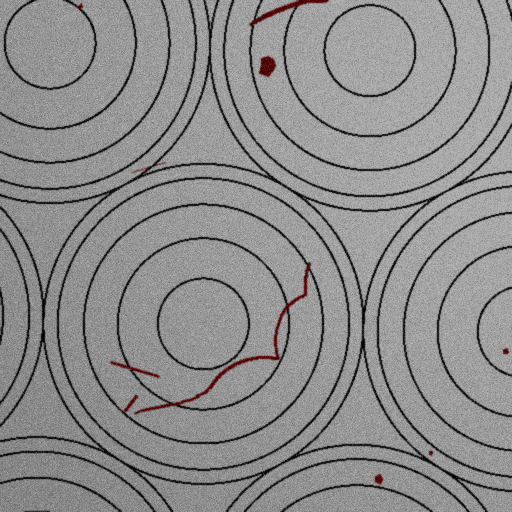</td>
</tr>

<tr>
<td>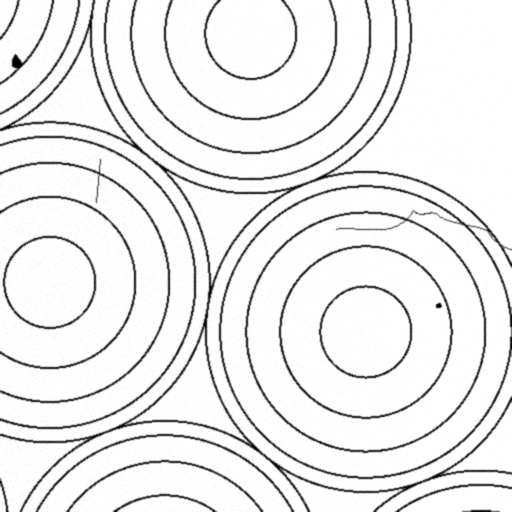</td>
<td>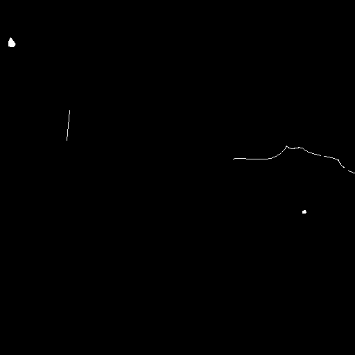</td>
<td>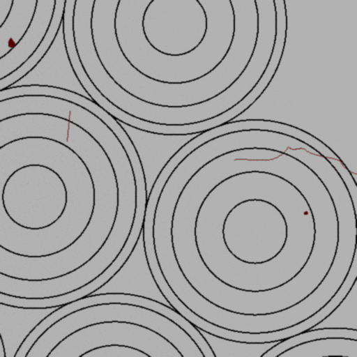</td>
</tr>

</table>

As the results show, the model successfully detects particles of varying size, shape, and intensity within the synthetic dataset environment, including challenging cases with highly structured and non-uniform backgrounds.

The ONNX inference pipeline achieved average inference times of approximately ~5 ms on GPU and ~30 ms on CPU for 512×512 images, indicating real-time capable performance. Tiled inference could further improve the processing of higher-resolution images and large-area inspection scenarios.

The presented approach therefore appears promising for future real-world industrial inspection applications.


## Alternative Approaches - Anomaly-Based Particle Detection

Instead of explicitly learning particle segmentation from annotated examples, future approaches could model the underlying particle-free structure and detect deviations as anomalies. Such methods are widely used in industrial visual inspection and may substantially reduce the dependency on pixel-level annotated training data [11].


## References

[1] asphericon GmbH, “The Laser-Induced Damage Threshold in High-Power Laser Optics”  
https://www.asphericon.com/en/blog/230123-the-laser-induced-damage-threshold-in-high-power-laser-optics/

[2] Holographix, “Microlens Arrays”  
https://holographix.com/microlens-arrays/

[3] Karangwa et al., “Optical Surface Defect Detection Using Semantic Segmentation”  
https://doi.org/10.1364/AO.424547

[4] Olaf Ronneberger, Philipp Fischer, Thomas Brox, “U-Net: Convolutional Networks for Biomedical Image Segmentation”  
https://doi.org/10.48550/arXiv.1505.04597

[5] Jonathan Long, Evan Shelhamer, Trevor Darrell, “Fully Convolutional Networks for Semantic Segmentation”  
https://doi.org/10.48550/arXiv.1411.4038

[6] Vijay Badrinarayanan, Alex Kendall, Roberto Cipolla, “SegNet: A Deep Convolutional Encoder-Decoder Architecture for Image Segmentation”  
https://doi.org/10.48550/arXiv.1511.00561

[7] Diederik P. Kingma, Jimmy Ba,
“Adam: A Method for Stochastic Optimization”  
https://doi.org/10.48550/arXiv.1412.6980

[8] Michael Yeung et al.,
“Unified Focal loss: Generalising Dice and cross entropy-based losses to handle class imbalanced medical image segmentation”  
https://doi.org/10.48550/arXiv.2102.04525

[9] Carole H. Sudre et al.,
“Generalised Dice overlap as a deep learning loss function for highly unbalanced segmentations”  
https://doi.org/10.48550/arXiv.1707.03237

[10] Keith A. Zou et al.,
“Statistical Validation of Image Segmentation Quality Based on a Spatial Overlap Index”  
https://doi.org/10.1016/S1076-6332(03)00671-8

[11] Yajie Cui, Zhaoxiang Liu, Shiguo Lian,
“A Survey on Unsupervised Anomaly Detection Algorithms for Industrial Images”  
https://doi.org/10.1109/ACCESS.2023.3282993